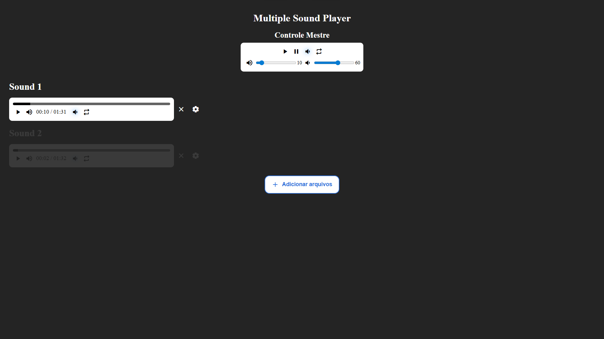

# Multiple Sound Player

## Sumário

- [Introdução](#introdução)
- [Estado do Projeto](#estado-do-projeto)
- [Dependências](#dependências)
- [Instalação e Uso](#instalação-e-uso)
- [Manual de Uso](#manual-de-uso)
   - [Controles](#controles)
      - [Botão loop e limitar volume](#botão-loop-e-limitar-volume)
      - [Configuração Local do Player](#configuração-local-do-player)
   - [Funções](#funções)
      - [Limitar volume](#limitar-volume)
      - [Loop](#loop)
      - [Configuração Global](#configuração-global)
- [Controle Mestre](#controle-mestre)
- [Configurações](#configurações)
- [Comandos (Atalhos de Teclado)](#comandos)
- [Adição de Arquivos](#adição-de-arquivos)
- [Créditos](#créditos)

## Introdução

O Multiple Sound Player é um player com o propósito de ouvir vários arquivos de áudio ao mesmo tempo, sem precisar fechar um áudio para abrir o outro.

Ele funciona tendo um player para cada áudio aberto e um player mestre que pode controlar todos os players abertos se configurado para fazê-lo.

O projeto foi feito no Python 3.12.4 e roda em um servidor local, toda a lógica é feita em JavaScript.

## Estado do Projeto

O projeto não está finalizado e pode ter mais funções no futuro, mas não está em foco no exato momento.

## Dependências

Python 3.12.4

Bibliotecas do Python usadas:

- os
- http.server
- socketserver
- webbrowser

## Instalação e uso

1. Baixe os arquivos (extraia se estiver comprimido) e coloque em qualquer pasta.
2. Execute o arquivo 'main.py', ele vai rodar um servidor local que executa a aplicação e abrir a página da aplicação automaticamente.
3. Arraste e solte qualquer arquivo de áudio na página e ele será aberto.

Também é possível usar uma versão online [aqui](https://vanzicleiton.github.io/multiple-sound-player/)

## Manual de Uso

### Controles

Na imagem, o primeiro player está destacado e os outros estão apagados, isso é porque o foco está no primeiro player e os comandos feitos usando o teclado serão aplicados nele.

Cada áudio aberto tem um player que age como controle daquele áudio. Ele tem as seguintes opções.

1. Botão de play/pause: Botão de dar play ou pause no áudio.

2. Botão de ativar/desativar o mudo: Ícone de volume que serve como botão que ativa e desativa o mudo.

3. Barra de volume: Como o nome já diz, é uma barra de volume.

4. Tempo de execução do áudio: Tempo atual e a duração do áudio.

5. Botão de mudar a configuração de limitar volume: Botão que muda a configuração de limitar o volume. Quando clicado, ele alterna o estado entre, desativado, seguir a configuração global, e ativado.

6. Botão de mudar a configuração de loop do áudio: Botão que alterna a configuração de loop do áudio. Funciona do mesmo jeito do botão de limitar volume.

7. Botão de fechar o player: Fecha o player e remove o áudio da página. É como fechar o player normalmente.

8. Botão de abrir as configurações do player: Abre a tela para editar as configurações daquele player.

Cada configuração do player tem a opção de seguir configuração local ou global do player mestre. Por exemplo, o volume, você pode configurar para seguir o volume do player local ou seguir o volume do player mestre, o mesmo vale para o loop do áudio e outras opções.

#### Botão loop e limitar volume

O botão de loop e de limitar volume quando clicados, mudam a configuração e mudam o visual dependendo da configuração definida.

Está desativado e não vai ter efeito.

Vai seguir a configuração global, Se estiver ativado no player mestre vai ativar, se estiver desativado vai desativar.

Vai ativar a opção independente da configuração do player mestre.

#### Configuração Local do Player

Opções

1. Ativar e desativar o loop.
2. Volume do player.
3. Volume máximo caso o limite de volume esteja ativado.
4. Ativar e desativar o limite de volume.

Ao lado de cada opção tem um globo que serve para definir se é para seguir a configuração global. Por exemplo se o globo da opção de volume estiver ativado, ele vai seguir o volume do player mestre.

 desativado

 Ativado

### Funções

#### Limitar volume

A opção de limitar volume como o nome diz, serve para limitar o volume e não deixar ele passar de um certo valor, por exemplo, se o volume máximo estiver definido em 60, o volume do player nunca vai passar de 60, mesmo tentando aumentar.

#### Loop

Repete o áudio quando acaba.

#### Configuração Global

Todas as opções de configuração do player podem ser definidas para seguir a configuração global do player mestre.

Exemplos.

1. Se o volume do player está definido para seguir a configuração global, ele vai ajustar o seu volume ao volume do player mestre sempre.

2. Se o volume máximo está definido para seguir a configuração global, ele sempre vai se ajustar pelo volume máximo do player mestre.

### Controle Mestre

O controle mestre tem funções que afetam todos os players que estiverem configurados para ser a configuração global, por exemplo se um player de áudio estiver definido para seguir o volume global, o volume do player mestre será aplicado nele.

Botões

1. Play. Dá play em todos os áudios abertos.
2. Pause. Dá pause em todos os áudios abertos.
3. Limitar Volume. Botão que ativa/desativa o limitar volume. Ativado ele fica iluminado.
4. Loop. Botão que ativa/desativa o loop. Ativado ele fica iluminado.
5. Barra de volume.
6. Barra de volume máximo que será seguido caso o limitar volume esteja ativado.

### Configurações

As configurações dos players e do player mestre não são salvas para usar depois, se a página for fechada ou atualizada elas serão perdidas.

### Comandos

Comandos que são ativados apertando as teclas de atalhos.

1. **VolumeUp** – ArrowUp – Aumenta o volume.
2. **VolumeDown** – ArrowDown – Diminui o volume.
3. **SelectPlayerUp** – Ctrl+ArrowDown – Seleciona o player de cima.
4. **SelectPlayerDown** – Ctrl+ArrowUp – Seleciona o player de baixo.
5. **ForwardShort** – Shift+ArrowRight – Avanço curto no áudio.
6. **ForwardMedium** – ArrowRight – Avanço médio no áudio.
7. **ForwardLong** – Ctrl+ArrowRight – Avanço longo no áudio.
8. **BackwardShort** – Shift+ArrowLeft – Recuo curto no áudio.
9. **BackwardMedium** – ArrowLeft – Recuo médio no áudio.
10. **BackwardLong** – Ctrl+ArrowLeft – Recuo longo no áudio.
11. **VolumeLimiterToggle** – L – Alterna a configuração do limitador de volume.
12. **LoopToggle** – R – Alterna a configuração do loop.
13. **MutedToggle** – M – Liga/desliga mudo.
14. **PauseToggle** – Espaço – Pausa ou reproduz.
15. **RemoveSound** – Shift+Delete – Remove o áudio atual.

### Adição de arquivos

Para adicionar um novo arquivo de áudio, é só arrastar e soltar os arquivos na página ou apertar o botão "Adicionar arquivos", que vai abrir uma janela pedindo para selecionar os arquivos, se for um arquivo de áudio, ele vai automaticamente abrir. A compatibilidade com os formatos depende no navegador, então mesmo se o arquivo for aberto pelo player, se o navegador não o aceitar, ele não vai funcionar.

## Créditos

Ícones usados: Material Symbols Outlined Variable Font do Google Fonts.
Código escrito por Vanzicleiton.

Comentário do Autor:

Desculpe se a explicação ficou confusa, garanto que usar a aplicação é mais fácil do que ler isso tudo.
